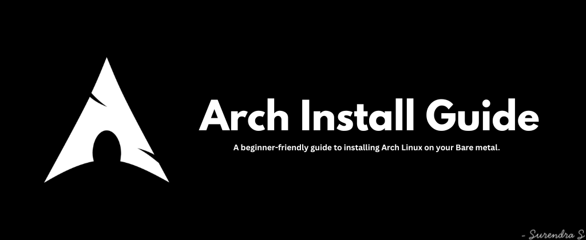

Arch Install Guide
===================

A beginner-friendly guide to installing Arch Linux on bare metal. Assumes you've already booted into the installer.iso.

Usage
-----

**1)** Keyboard & internet
```sh
loadkeys us
iwctl
ping archlinux.org
```
> Set your layout, connect to Wi-Fi from inside `iwctl`, then confirm the connection is up. `Ctrl + C` to stop the ping.

**2)** Partitioning
```sh
cfdisk
lsblk
```
> Create your partitions (EFI, root, swap), then double-check them once.

**3)** Formatting
```sh
mkfs.ext4 /dev/sdX3
mkfs.fat -F 32 /dev/sdX1
mkswap /dev/sdX2
```
> Root as ext4, EFI as FAT32, swap prepared.

**4)** Mounting
```sh
mount /dev/sdX3 /mnt
mkdir -p /mnt/boot/efi
mount /dev/sdX1 /mnt/boot/efi
swapon /dev/sdX2
```
> Mount root to `/mnt`, mount EFI into `/mnt/boot/efi`, swap turned on.

**5)** Base install
```sh
pacstrap /mnt base linux linux-firmware sof-firmware base-devel grub efibootmgr nano networkmanager
genfstab -U /mnt >> /mnt/etc/fstab
arch-chroot /mnt
```
> Install the kernel with base, firmware, bootloader (`grub`), and `networkmanager`, write the fstab, then chroot into the new system.

**6)** System config
```sh
ln -sf /usr/share/zoneinfo/Asia/Dubai /etc/localtime
hwclock --systohc
```
> Set your timezone and sync the hardware clock.

```sh
nano /etc/locale.gen
locale-gen
```
> Uncomment your locale, then run `locale-gen`.

```sh
nano /etc/locale.conf
nano /etc/vconsole.conf
nano /etc/hostname
```
> Set `LANG`, set the TTY keyboard layout, and name your machine.

**7)** Users
```sh
passwd
useradd -m -g wheel -s /bin/bash denshi
passwd denshi
EDITOR=nano visudo
```
> Set the root password, create your user with a home folder and the `wheel` group, set their password, then uncomment the `wheel` line in visudo so they can `sudo`.

**8)** Bootloader
```sh
systemctl enable NetworkManager
grub-install /dev/sdX
grub-mkconfig -o /boot/grub/grub.cfg
```
> Enables networking on boot, installs GRUB to the disk (not a partition), and builds its config.

**9)** Wrapping up
```sh
exit
umount -a
reboot
```
> Leave chroot, unmount everything, reboot. Pull the install media before it comes back up.

**10)** Desktop (KDE Plasma)
```sh
pacman -S plasma sddm
pacman -S konsole kate firefox
systemctl enable --now sddm
```
> Installs Plasma, a login manager, a terminal, an editor, and a browser — then starts the login screen right away.


Requirements
------------
- A working internet connection during install
- An Arch Linux installation medium


Acknowledgement
----------------

This guide follows the standard installation flow documented by the [**Arch Linux**](https://archlinux.org/) project, and installs [**KDE Plasma**](https://kde.org/plasma-desktop/) as the desktop environment. All packages referenced come from the official Arch repositories.


References
----------

- [Arch Wiki – Installation Guide](https://wiki.archlinux.org/title/Installation_guide)
- [Arch Wiki – General Recommendations](https://wiki.archlinux.org/title/General_recommendations)
- [Arch Wiki – KDE Plasma](https://wiki.archlinux.org/title/KDE)


License
-------

```
MIT License

Copyright (c) 2026 Surendra S

Permission is hereby granted, free of charge, to any person obtaining a copy
of this software and associated documentation files (the "Software"), to deal
in the Software without restriction, including without limitation the rights
to use, copy, modify, merge, publish, distribute, sublicense, and/or sell
copies of the Software, and to permit persons to whom the Software is
furnished to do so, subject to the following conditions:

The above copyright notice and this permission notice shall be included in all
copies or substantial portions of the Software.

THE SOFTWARE IS PROVIDED "AS IS", WITHOUT WARRANTY OF ANY KIND, EXPRESS OR
IMPLIED, INCLUDING BUT NOT LIMITED TO THE WARRANTIES OF MERCHANTABILITY,
FITNESS FOR A PARTICULAR PURPOSE AND NONINFRINGEMENT. IN NO EVENT SHALL THE
AUTHORS OR COPYRIGHT HOLDERS BE LIABLE FOR ANY CLAIM, DAMAGES OR OTHER
LIABILITY, WHETHER IN AN ACTION OF CONTRACT, TORT OR OTHERWISE, ARISING FROM,
OUT OF OR IN CONNECTION WITH THE SOFTWARE OR THE USE OR OTHER DEALINGS IN THE
SOFTWARE.
```
